  

## 📌 About Me
- 💻 Full-Stack Developer at Sanvya
- 🎓 MCA Student at SRM University, Chennai
- 🎓 BCA Graduate from DHSK College, Dibrugarh, Assam
- 🏥 Building an infrastructure used for real healthcare workflows
- ⚙️ Focused on building scalable backend systems and production-ready applications

## 📊 GitHub Stats & Trophies

  
  

  

  

  

## 🛠️ Languages & Tools

<h3 align="center">Programming Languages</h3>

  
  
  
  
  

<h3 align="center">Frontend</h3>

  
  
  
  
  
  
  
  

<h3 align="center">Backend</h3>

  
  
  
  

<h3 align="center">Database</h3>

  
  
  
  
  

<h3 align="center">DevOps & Cloud</h3>

  
  
  
  

<h3 align="center">Tools</h3>

  
  
  
  

  

## 🔗 Connect with Me

  
  
  

  

  

