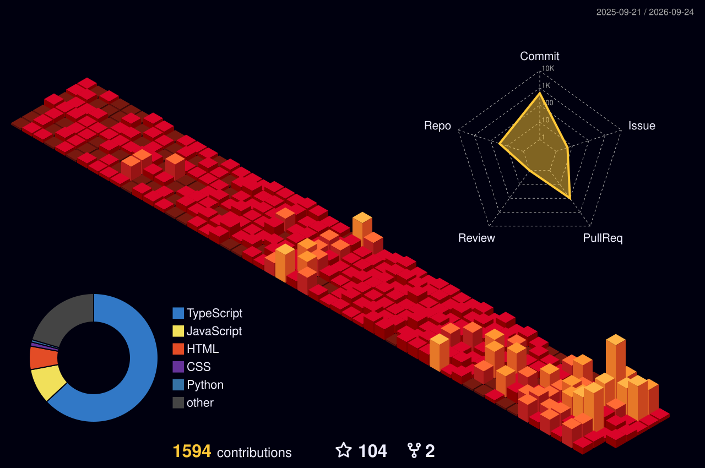

  

  

## 📌 About Me:
- 🎓 MCA Student at SRM KTR, Chennai
- 🎓 BCA Graduate from DHSK College, Dibrugarh, Assam
- ⚙️ Focused on building scalable backend systems and production-ready applications

## 📊 GitHub Stats 

  
  

 

## 🛠️ Languages & Tools

<h3 align="center">Programming Languages</h3>

  
  
  
  
  

<h3 align="center">Frontend</h3>

  
  
  
  
  
  
  
  

<h3 align="center">Backend</h3>

  
  
  
  

<h3 align="center">Database</h3>

  
  
  
  
  

<h3 align="center">DevOps & Cloud</h3>

  
  
  
  

<h3 align="center">Tools</h3>

  
  
  
  

  

<h2 align="center">🚀 Featured Projects</h2>

Building products that blend clean design with thoughtful engineering.

<table align="center" width="100%">
<tr>
<td width="50%" valign="top">

<h3 align="center">🌐 Portfolio Website </h3>

A personal portfolio showcasing my work, projects, and engineering journey.

</td>

<td width="50%" valign="top">

<h3 align="center">⚡ Requestly</h3>

A developer workspace for discovering, inspecting, and testing public APIs.

</td>
</tr>
<tr>

<td width="50%" valign="top">

<h3 align="center">🎁 GitWrapped</h3>

Beautiful GitHub Wrapped experience inspired by Spotify Wrapped.

</td>

<td width="50%" valign="top">

<h3 align="center">🗺️ CodeAtlas</h3>

Discover, organize and explore the best developer resources.

</td>

</tr>

<tr>

<td width="50%" valign="top">

<h3 align="center">🖼️ ArtGallery</h3>

A modern digital art gallery focused on elegant presentation and simplicity.

 

</td>

<td width="50%" valign="top">

<h3 align="center">💬 YapRecap</h3>

Transform chats into beautiful yearly recaps inspired by Spotify Wrapped.

</td>

</tr>

</table>

## 🔗 Connect with Me

  
  
  

